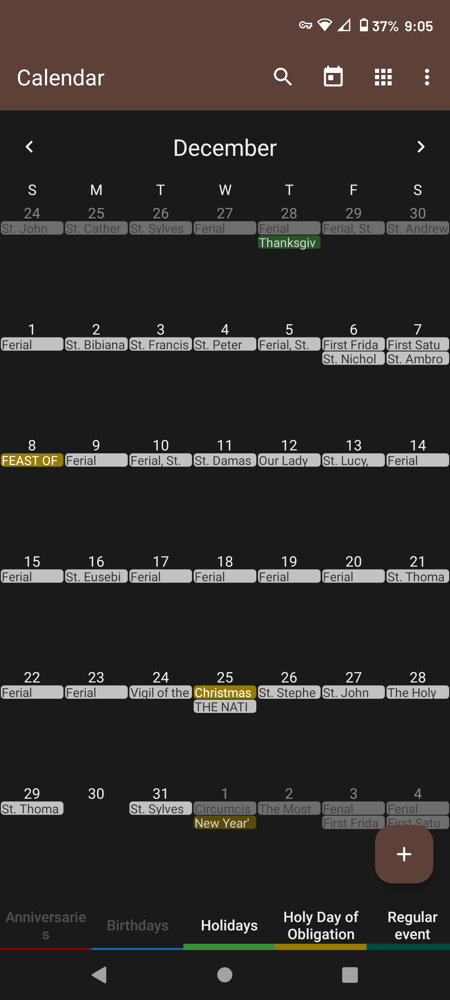
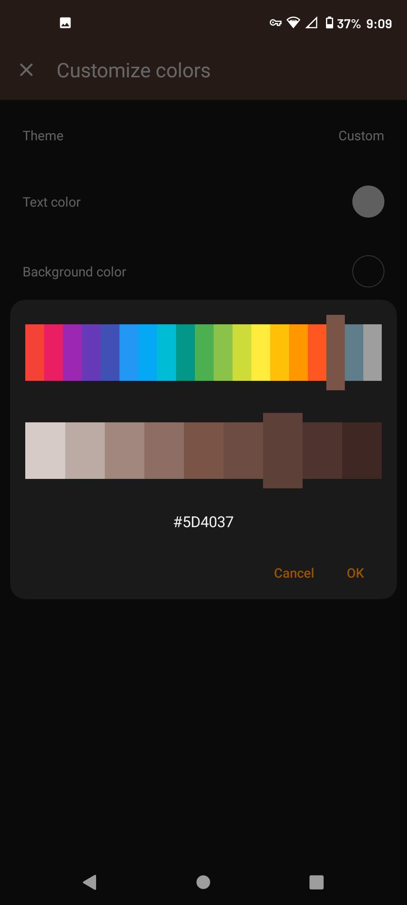
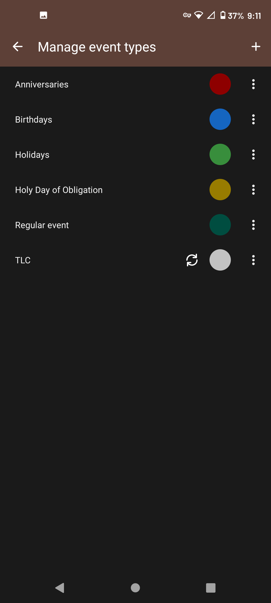

# Liturgical Calendar

liturgical Calendar 2024 is a highly customizable, offline monthly calendar app for Android. Have an agenda planner in your pocket, designed to do exactly what a personal tiny schedule planner should do in 2024. No complicated features, unnecessary permissions, or ads! Plus, displays all the saints of the day and holy days of obligation from the Roman Catholic Calendar. It even supports syncing events via Google Calendar

Daily Digital Schedule App: Take Control of Your Time
Whether you are looking for a work calendar for business, a day planner, an appointment scheduler, or organization and scheduling of single and recurring events like birthdays, anniversary, appointment reminder, or anything else, Liturgical Calendar 2024 makes it easy to stay organized. The calendar widget has an incredible variety of customization options: customize event reminders, notification appearance, tiny calendar reminders widget, and overall appearance.

Schedule Planner: Plan Your Day
Appointment scheduler, monthly planner, and family organizer in one! Check your upcoming agenda, schedule business meetings, and events & book appointments easily. Reminders will keep you on time and informed on your daily schedule app. This 2024 calendar widget is remarkably easy to use. You can even view everything as a simple list of events rather than in a monthly view, so you know exactly what’s coming up in your life and how to organize and plan your agenda. 

Liturgical Calendar 2024 Features

## Features:
➕ No ads or annoying popups, truly great user experience!  
➕ No internet access is needed, giving you more privacy, security, and stability  
➕ Calendar Widget supports exporting & importing events via .ics files  
➕ Export settings to .txt files to import to another device  
➕ Flexible event creation – times, duration, reminders, powerful repetition rules  
➕ CalDAV support for syncing events via Google Calendar, Microsoft Outlook, Nextcloud, Exchange, etc

Forked from simplemobiletools Calendar
Check out the full suite of Simple Tools <a href='https://www.simplemobiletools.com'>here!</a>
