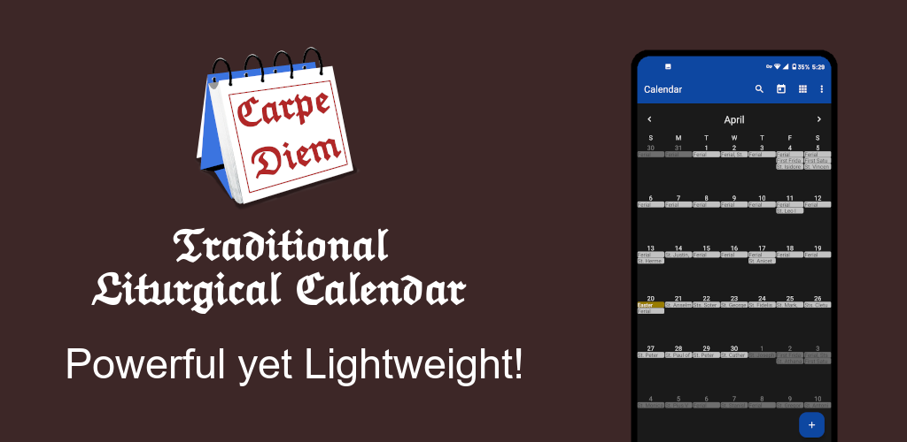
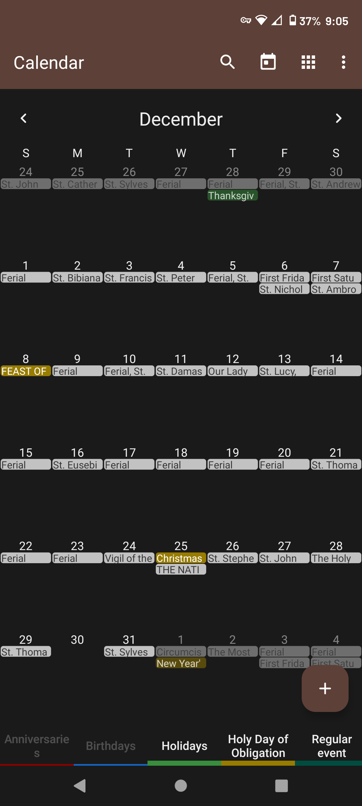
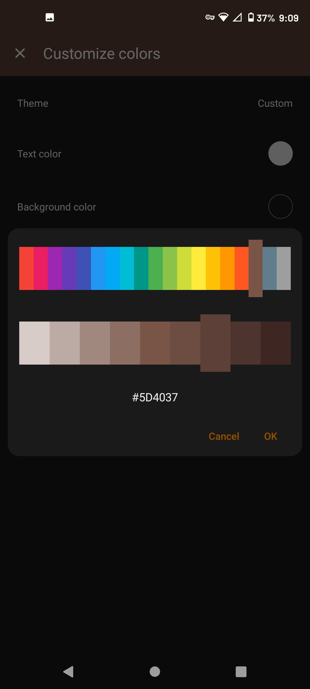
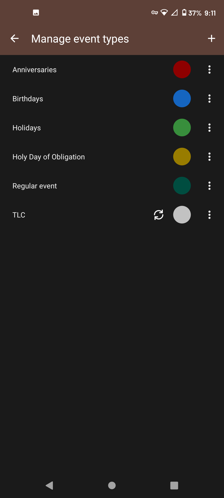

# Liturgical Calendar

Seize the day (Carpe Diem) with Liturgical Calendar app for android. This app is a privacy friendly, offline monthly calendar. It's your daily planner in your pocket. This app takes privacy seriously with limited permissions, no ads, and no internet access! Plus, it displays all the saints of the day and holy days of obligation from the Traditional Roman Catholic Calendar. It even supports syncing events via Google Calendar.

Never miss a birthday or anniversary with the built in event reminders. Schedule your appointments, make To Do lists, or link your work calendar. Liturgical calendar helps you stay organized. Powerful customizations from notifications, reminders, and colors. Comes with dark theme by default but has light themes or any color you want. With 3 widgets to choose from, you won't miss a day!

## Key Features:
➕ No ads or popups  
➕ No internet access, giving you more privacy and security  
➕ Calendar Widget supports exporting & importing events via .ics files  
➕ Export settings to .txt files to import to another device  
➕ Flexible event creation – times, duration, reminders, powerful repetition rules  
➕ CalDAV support for syncing events via Google Calendar, Microsoft Outlook, Nextcloud, Exchange, etc

